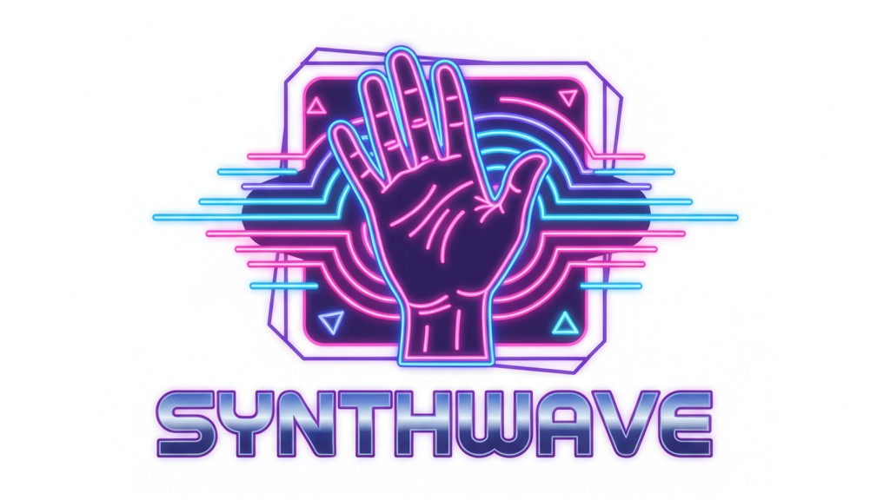

# Synthwave (HackRPI 2025 Project)

Physically controlled generative music

[Devpost](https://devpost.com/software/synthwave-8fgo0c)

[Youtube Webcam Demo](https://youtu.be/fB2qbgKe9yw)

[Youtube Tello Drone Demo](https://youtube.com/shorts/Q5GYdat9SSQ)

## Setup

- Install [`uv`](https://docs.astral.sh/uv/)
- Install dependencies: `uv sync`
- Run the script: `uv run src/hackrpi_2025/main.py`
- It will send MIDI messages to your computer's first MIDI output device based on the position of your hand.
